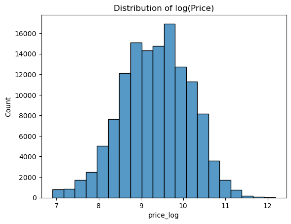
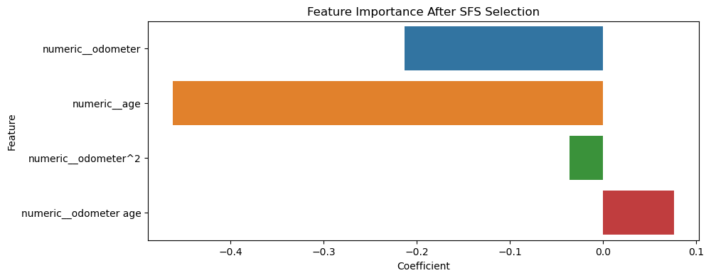

# Berkley Haas - Professional Certificate in Machine Learning and Artificial Intelligence - Module 11 - Practical Application 2

<!-- TOC depthfrom:2 -->

- [Background](#background)
- [What drives the price of a car?](#what-drives-the-price-of-a-car)
- [CRISP-DM](#crisp-dm)
    - [Overview of Data](#overview-of-data)
    - [Data Cleaning and Transformation](#data-cleaning-and-transformation)
    - [Fitting Models](#fitting-models)
    - [Coefficient Analysis](#coefficient-analysis)
- [Next Steps](#next-steps)

<!-- /TOC -->

## Background

This is a demonstration of application of skills learned during Part 2 of the program; Modules 6 to 11. Specifically, demonstrates execution of one round of CRISP-DM framework.

## What drives the price of a car?

The dataset comes from Kaggle. The original dataset contained more data but was trimmed to 426K cars to ensure speed of processing. The goal is to understand what factors make a car more or less expensive. As a result of the analysis, we provide clear recommendations to your client -- a used car dealership -- as to what consumers value in a used car.

## CRISP-DM

CRISP-DM framework phases are detailed in following [Jupyter Notebook](prompt_II.ipynb). You will find in there all the details and steps used to complete Business Understanding, Data Understanding, Data Preparation, Modeling and Evaluation.

Technologies and runtime libraries used include: Python, Pandas, Seaborn and scikit-learn.

### Overview of Data

* There is a lot of missing values. 72% to 40% for some features.
* Outliers are omnipresent:
    * Car's year model information has bogus entries.
    * Some odometer values are off the charts, like 10 million miles.
    * Price has plenty of 0-values but also irrational values, like $3,736,928,711.
* The target univariate -- car sale price -- is not normally distributed. 

### Data Cleaning and Transformation  

* Removed cars older than year 2000. Also added new column 'age'.
* Removed cars with mileage over 200k miles.
* Keep entries where price is in range: ~500 to ~300,000. 
* Convert price to logarithmic representation to get normal distribution. 
* Dropped columns with no relevant data, or with majority of missing data.
* Dropped some categorical columns that would just increase number of features. We can come back to them later. 
* Left with 130,077 entries down from 426,880. 

### Fitting Models

Following models were trained:
* Linear Regression.
* Ridge Model with Default Alpha.
* Ridge Model with Optimal Alpha using Grid Search.
* Linear Regression with SFS selection based on Lasso estimator.

All above models performed nearly identically. $R^2$ score around 0.52 and MSE around 0.30.

### Coefficient Analysis

It is clear even without the SFS selection that Car's age (year) and odometer reading (mileage) are the key drivers of car's price.

* Linear Regression Coefficients 
* Coefficients after SFS 

Other features don't quite influence the sales price.

## Next Steps

It would be good to explore other categorical features that were initially dropped, especially condition. Encode them and see how they influence sales price.
